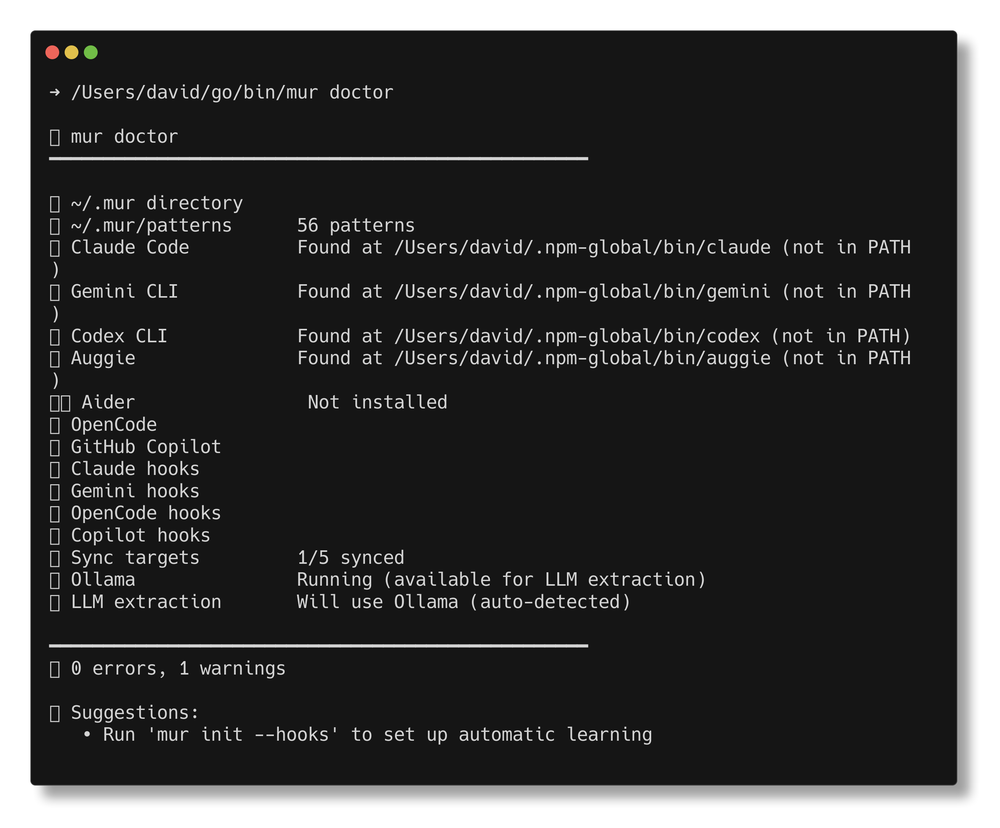
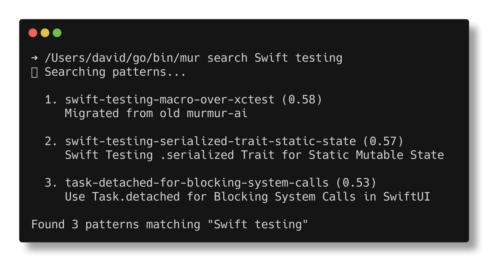
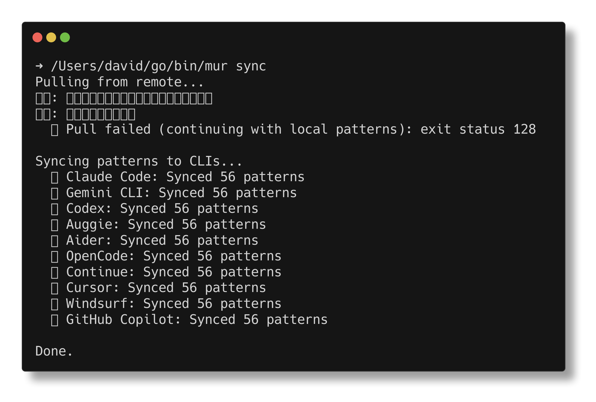
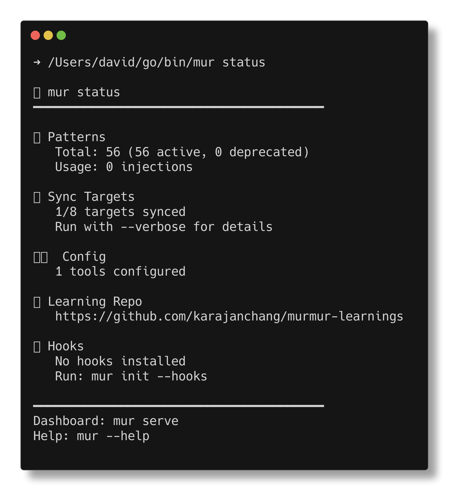

# MUR Core 🔊

[](https://go.dev)
[](https://github.com/mur-run/mur-core/releases)
[](./LICENSE)

**Your AI assistant's memory.**

MUR Core captures patterns from your coding sessions and injects them back into your AI tools. Learn once, remember forever. Works invisibly — just use your CLI as normal.

## ✨ Features

- **🧠 Continuous Learning** — Extract patterns from Claude Code, Gemini CLI sessions
- **🔄 Universal Sync** — Patterns sync to 10+ AI tools (Claude, Gemini, Codex, Cursor, etc.)
- **🔌 Zero Friction** — Install hooks once, then forget about it
- **📊 Dashboard** — Web UI for pattern management and analytics
- **🔒 Local First** — All data stays on your machine (optional git sync)

## 📸 Screenshots

<details>
<summary>mur doctor — Health check</summary>



</details>

<details>
<summary>mur search — Semantic pattern search</summary>



</details>

<details>
<summary>mur index status — Embedding index status</summary>


</details>

<details>
<summary>mur sync — Sync to all AI tools</summary>



</details>

<details>
<summary>mur status — Quick overview</summary>



</details>

## 🚀 Quick Start

```bash
# Install (macOS)
brew tap mur-run/tap && brew install mur

# Or with Go (macOS/Linux)
CGO_ENABLED=0 go install github.com/mur-run/mur-core/cmd/mur@latest

# Setup
mur init --hooks

# Done! Use your AI CLI normally — mur works invisibly
claude "fix this bug"
```

## 📦 Installation

### macOS (Recommended)

```bash
brew tap mur-run/tap
brew install mur

# Verify
mur version
```

### macOS / Linux (Go Install)

```bash
CGO_ENABLED=0 go install github.com/mur-run/mur-core/cmd/mur@latest

# Add to PATH (if not already)
export PATH="$HOME/go/bin:$PATH"

mur version
```

> **📍 Path Differences:**
> - Homebrew: `/opt/homebrew/bin/mur` (Apple Silicon) or `/usr/local/bin/mur` (Intel)
> - Go install: `~/go/bin/mur`
>
> Make sure the correct path is in your `$PATH`. If you have both installed, Homebrew typically takes precedence.

### Windows

**PowerShell:**
```powershell
$env:CGO_ENABLED=0; go install github.com/mur-run/mur-core/cmd/mur@latest
mur version
```

**CMD:**
```cmd
set CGO_ENABLED=0 && go install github.com/mur-run/mur-core/cmd/mur@latest
mur version
```

### From Git

```bash
git clone https://github.com/mur-run/mur-core.git
cd mur-core
make install
```

### PATH Setup

> **Note:** Only needed for `go install`. If you installed via **Homebrew**, skip this section — `brew` handles PATH automatically.

<details>
<summary>macOS / Linux (go install only)</summary>

```bash
# Zsh (macOS default)
echo 'export PATH="$HOME/go/bin:$PATH"' >> ~/.zshrc
source ~/.zshrc

# Bash (Linux default)
echo 'export PATH="$HOME/go/bin:$PATH"' >> ~/.bashrc
source ~/.bashrc
```

</details>

<details>
<summary>Windows</summary>

**Option 1: PowerShell (temporary)**
```powershell
$env:PATH += ";$env:USERPROFILE\go\bin"
```

**Option 2: Permanent (GUI)**
1. Search "Environment Variables" → "Edit system environment variables"
2. Click "Environment Variables" → User variables → `Path` → Edit
3. Add `%USERPROFILE%\go\bin`
4. Restart terminal

</details>

<details>
<summary>📋 Troubleshooting</summary>

**"command not found: mur"**
- macOS/Linux: `export PATH="$HOME/go/bin:$PATH"`
- Windows: Add `%USERPROFILE%\go\bin` to PATH

**"LC_UUID" error on macOS**  
Use `CGO_ENABLED=0` when installing (already included above).

**Ollama not running?**  
Semantic search still works using cached embeddings. After Ollama is back:
```bash
mur index rebuild
```

**Check installation**
```bash
mur doctor
```

</details>

## 🎯 How It Works

```
┌──────────────────────────────────────────────┐
│  You use AI CLIs normally                     │
│                                               │
│  $ claude "explain this code"                 │
│  $ gemini "fix the bug"                       │
└──────────────────────────────────────────────┘
                    │
                    ▼
┌──────────────────────────────────────────────┐
│  mur hooks inject relevant patterns           │
│                                               │
│  [context: your-project-patterns.md]          │
│  [context: learned-from-last-week.md]         │
└──────────────────────────────────────────────┘
                    │
                    ▼
┌──────────────────────────────────────────────┐
│  AI responds with project context             │
│                                               │
│  "Based on your navigation pattern, use..."   │
└──────────────────────────────────────────────┘
                    │
                    ▼
┌──────────────────────────────────────────────┐
│  mur learns from the session (optional)       │
│                                               │
│  $ mur learn extract --auto                   │
└──────────────────────────────────────────────┘
```

## 📋 Commands

### Core

| Command | Description |
|---------|-------------|
| `mur init` | Interactive setup wizard |
| `mur init --hooks` | Quick setup with CLI hooks |
| `mur status` | Overview of patterns, sync status |
| `mur doctor` | Diagnose and fix issues |
| `mur sync` | Sync patterns to all AI tools |

### Patterns

| Command | Description |
|---------|-------------|
| `mur new <name>` | Create new pattern |
| `mur edit <name>` | Edit pattern in $EDITOR |
| `mur search <query>` | Semantic search patterns |
| `mur copy <name>` | Copy pattern to clipboard |
| `mur examples` | Install example patterns |
| `mur migrate` | Migrate patterns to v2 schema |

### Semantic Search

| Command | Description |
|---------|-------------|
| `mur index status` | Check embedding index status |
| `mur index rebuild` | Rebuild all embeddings |
| `mur search <query>` | Search patterns by meaning |
| `mur search --json` | JSON output for scripts |

### Learning

| Command | Description |
|---------|-------------|
| `mur transcripts` | Browse Claude Code sessions |
| `mur learn extract` | Extract patterns from sessions |
| `mur learn extract --auto` | Auto-extract high-confidence patterns |
| `mur import <file>` | Import from file or URL |

### Dashboard

| Command | Description |
|---------|-------------|
| `mur serve` | Start web dashboard |
| `mur dashboard` | Generate static HTML report |
| `mur stats` | View usage statistics |

<details>
<summary>📖 All Commands</summary>

```
mur
├── init           # Setup wizard
├── status         # Quick overview
├── doctor         # Diagnose issues
├── sync           # Sync to AI tools
├── new            # Create pattern
├── edit           # Edit pattern
├── search         # Search patterns
├── copy           # Copy to clipboard
├── examples       # Install examples
├── import         # Import patterns
├── export         # Export patterns
├── config         # View/edit config
├── transcripts    # Browse sessions
├── serve          # Web dashboard
├── dashboard      # Static report
├── stats          # Usage stats
├── clean          # Cleanup old files
├── version        # Show version
├── web            # Open docs/GitHub
└── learn
    ├── list       # List patterns
    ├── get        # Show pattern
    ├── add        # Add pattern
    ├── delete     # Delete pattern
    ├── sync       # Sync to CLIs
    └── extract    # Extract from sessions
```

</details>

## 🔄 Supported Tools

**AI CLIs** (with hooks for real-time injection):
- Claude Code
- Gemini CLI
- Auggie (Augment CLI)

**AI CLIs** (static sync):
- Codex
- Aider

**IDEs** (static sync):
- Continue
- Cursor
- Windsurf

## 🔍 Semantic Search

v1.1+ includes intelligent pattern matching using embeddings. Instead of keyword search, mur finds patterns by *meaning*.

### Install Ollama

<details>
<summary>macOS</summary>

```bash
brew install ollama
ollama serve &
ollama pull nomic-embed-text
```

</details>

<details>
<summary>Linux</summary>

```bash
curl -fsSL https://ollama.com/install.sh | sh
ollama serve &
ollama pull nomic-embed-text
```

</details>

<details>
<summary>Windows</summary>

1. Download [Ollama for Windows](https://ollama.com/download/windows)
2. Install and launch
3. Open PowerShell:
```powershell
ollama pull nomic-embed-text
```

</details>

### OpenAI Embeddings (Alternative)

No GPU? Use OpenAI's embedding API instead of Ollama:

```yaml
# ~/.mur/config.yaml
search:
  provider: openai
  model: text-embedding-3-small  # or text-embedding-3-large
  min_score: 0.7                 # OpenAI scores are higher
```

```bash
export OPENAI_API_KEY=sk-xxx
mur index rebuild
```

| Model | Dimensions | Cost | Notes |
|-------|-----------|------|-------|
| `text-embedding-3-small` | 1536 | $0.02/1M tokens | Fast, cheap (recommended) |
| `text-embedding-3-large` | 3072 | $0.13/1M tokens | More accurate |

**Ollama vs OpenAI:**
- Ollama: Free, offline, local GPU needed, scores ~0.5-0.6
- OpenAI: Paid, requires internet, no GPU, scores ~0.7-0.9

### Build Index

```bash
mur index rebuild
```

### Usage

```bash
# Search by meaning
mur search "How to test async Swift code"
# → swift-testing-macro-over-xctest (0.58)

# The hook auto-suggests patterns in Claude Code
claude "fix this async test"
# → [mur] 🎯 Relevant patterns: swift-testing-macro-over-xctest
```

### Directory Sync Format

v1.1+ uses individual skill directories instead of one large file:

```bash
# Before: ~/.claude/skills/mur-patterns.md (35KB, ~8,750 tokens)
# After:  ~/.claude/skills/swift--testing-macro/SKILL.md (~150 tokens)

mur sync                  # Uses new directory format (default)
mur sync --format single  # Legacy format still available
```

This reduces token usage by **90%+** — Claude loads only the patterns it needs.

### Configuration

```yaml
# ~/.mur/config.yaml
search:
  enabled: true
  provider: ollama              # ollama | openai
  model: nomic-embed-text       # embedding model (see table below)
  ollama_url: http://localhost:11434   # for provider: ollama
  # openai_url: https://api.openai.com/v1  # for provider: openai
  # api_key_env: OPENAI_API_KEY            # env var name (not the key!)
  top_k: 3                      # max results per search
  min_score: 0.5                # minimum similarity (0.0-1.0)
  auto_inject: false
    # false = inject patterns by project/tags only (mur context)
    # true  = also inject semantically similar patterns (mur search --inject)
```

**Embedding models:**
| Provider | Model | min_score |
|----------|-------|-----------|
| ollama | `nomic-embed-text` | 0.5 |
| openai | `text-embedding-3-small` | 0.7 |
| openai | `text-embedding-3-large` | 0.7 |

## 🔧 Configuration

```yaml
# ~/.mur/config.yaml

default_tool: claude

tools:
  claude:
    enabled: true
  gemini:
    enabled: true

learning:
  repo: git@github.com:you/patterns.git  # Optional: sync across machines
  auto_push: true
  llm:
    provider: ollama           # ollama | openai | gemini | claude
    model: deepseek-r1:8b      # LLM model for extraction
    ollama_url: http://localhost:11434
    openai_url: https://api.openai.com/v1  # or Groq, Together, etc.
```

Set your default LLM, then just run:
```bash
mur learn extract --llm          # Uses config default
mur learn extract --llm openai   # Override with OpenAI
mur learn extract --llm gemini   # Override with Gemini
```

### API Keys

API keys are configured via environment variables (not in config file for security):

```bash
# Add to ~/.zshrc or ~/.bashrc
export ANTHROPIC_API_KEY="sk-ant-..."     # For Claude
export OPENAI_API_KEY="sk-..."            # For OpenAI
export GEMINI_API_KEY="..."               # For Gemini
```

Then reference in config by variable name:

```yaml
learning:
  llm:
    provider: claude
    model: claude-sonnet-4-20250514
    api_key_env: ANTHROPIC_API_KEY    # ← Variable NAME, not the key itself
```

This keeps your API keys secure and out of config files.

### Premium Model Routing

Use a better (more expensive) model for important sessions:

```yaml
learning:
  llm:
    provider: ollama
    model: deepseek-r1:8b       # Default: local, free
    
    premium:
      provider: gemini
      model: gemini-2.0-flash
      api_key_env: GEMINI_API_KEY
    
    routing:
      min_messages: 20          # Use premium for long sessions
      projects: [my-app, core]  # Use premium for these projects
```

Sessions matching routing rules automatically use the premium model:
```
📝 Session: abc123 (my-app)
   ⭐ Using premium model (project match)
```

### Remote Ollama (LAN Setup)

Run Ollama on a powerful server and access it from other machines.

#### Server Setup

<details>
<summary>macOS (server)</summary>

```bash
# Make Ollama listen on all interfaces
launchctl setenv OLLAMA_HOST "0.0.0.0"
brew services restart ollama
```

</details>

<details>
<summary>Linux (server)</summary>

```bash
# Edit systemd service
sudo systemctl edit ollama

# Add these lines:
[Service]
Environment="OLLAMA_HOST=0.0.0.0"

# Restart
sudo systemctl restart ollama
```

</details>

<details>
<summary>Windows (server)</summary>

1. Open "Environment Variables" settings
2. Add system variable: `OLLAMA_HOST` = `0.0.0.0`
3. Restart Ollama

</details>

#### Client Setup

Add to your config file:

- **macOS/Linux:** `~/.mur/config.yaml`
- **Windows:** `%USERPROFILE%\.mur\config.yaml`

```yaml
search:
  enabled: true
  provider: ollama
  model: nomic-embed-text
  ollama_url: http://192.168.1.100:11434  # Server IP
  min_score: 0.5

learning:
  llm:
    provider: ollama
    model: deepseek-r1:8b
    ollama_url: http://192.168.1.100:11434  # Server IP
```

Then rebuild the index:
```bash
mur index rebuild
```

This way, laptops can use embeddings and LLM extraction without running models locally.

### Recommended Models

| Provider | Model | Notes |
|----------|-------|-------|
| Ollama | `deepseek-r1:8b` | Best for extraction, 5GB |
| Ollama | `qwen2.5:14b` | Good for code, 9GB |
| OpenAI | `gpt-4o-mini` | Cheap & fast |
| Gemini | `gemini-2.0-flash` | Free tier available |
| Claude | `claude-sonnet-4-20250514` | Best quality |

## 📊 Dashboard

```bash
# Interactive web dashboard
mur serve
# → http://localhost:8080

# Static HTML report
mur dashboard -o report.html
```

Features:
- Pattern browser with search/filter
- Usage statistics and charts
- Sync status across tools
- One-click pattern editing

## ☁️ Cloud Sync

Sync patterns across devices and share with your team via [mur.run](https://mur.run).

```bash
# Login (OAuth - opens browser)
mur login

# Or login with API key (for CI/automation)
# Create keys at: https://app.mur.run/core/settings
mur login --api-key mur_xxx_...

# Check who you're logged in as
mur whoami

# Push local patterns to cloud
mur cloud sync push

# Pull patterns from cloud
mur cloud sync pull

# Logout
mur logout
```

### Plans

| Plan | Price | Features |
|------|-------|----------|
| **Free** | $0/mo | Unlimited local patterns, all tool integrations |
| **Pro** | $19/mo | Cloud sync, cross-device patterns |
| **Team** | $49/mo | 5 team members, shared pattern library |

Learn more at [mur.run/products/core](https://mur.run/products/core)

## 💻 System Requirements

- **Go 1.21+** (for installation from source)
- **Platforms:** macOS, Linux, Windows
- **Optional:** Ollama (for semantic search & LLM extraction)

## 📁 Directory Structure

**macOS / Linux:** `~/.mur/`  
**Windows:** `%USERPROFILE%\.mur\`

```
.mur/
├── config.yaml      # Configuration
├── patterns/        # Your patterns (YAML)
├── hooks/           # CLI hook scripts
├── embeddings/      # Semantic search cache
├── stats.jsonl      # Usage statistics
└── repo/            # Git sync repo (optional)
```

## 🤝 Contributing

Issues and PRs welcome!

```bash
git clone https://github.com/mur-run/mur-core.git
cd mur-core
make check  # lint + test
```

## 📄 License

MIT — use it however you want.
